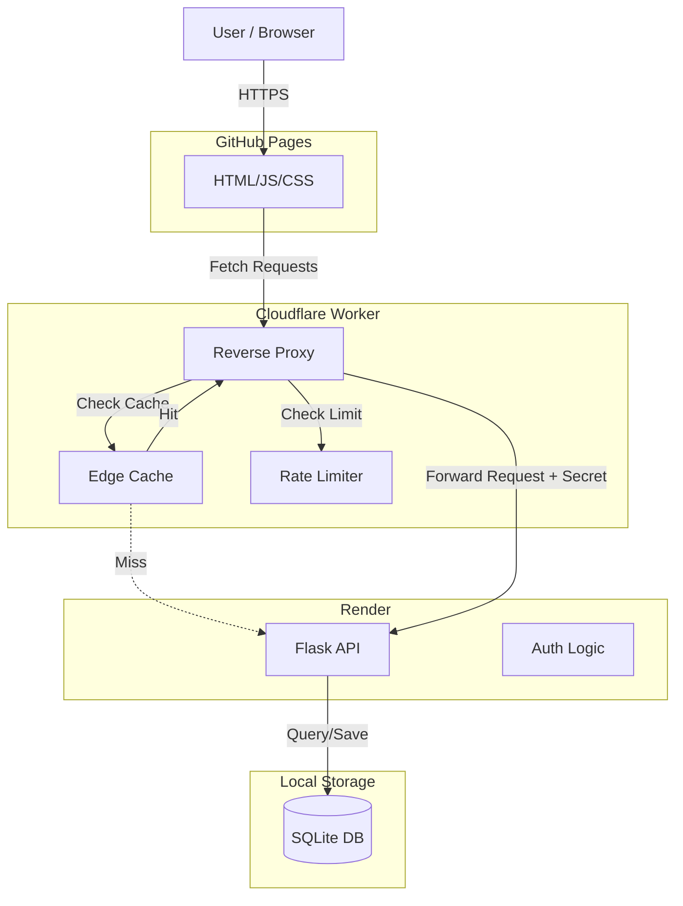

# D&D Character Creator - Architecture Overview

## High-Level Architecture

This project uses a **Three-Tier Architecture** with an additional **Edge Middleware** layer for performance and security.

---

## Component Breakdown

### 1. Frontend (Client-Side)
- **Host**: GitHub Pages (served from `/docs` directory).
- **Tech Stack**: Vanilla HTML5, JavaScript (ES6+), Tailwind CSS (via CDN).
- **Key Files**:
    - `docs/*.html`: The UI pages (Dashboard, Login, Character Creator).
    - `docs/static/js/config.js`: Configuration (API Base URL).
    - `docs/static/js/api.js`: Wrapper for `fetch` to handle headers and errors.
- **Responsibility**: Renders the UI, handles user input, and makes API calls to the Edge layer.

### 2. Edge Middleware (The "Smart" Proxy)
- **Host**: Cloudflare Workers.
- **Entry Point**: `index.js` (Component Root).
- **Tech Stack**: JavaScript (Service Worker API).
- **Key Responsibilities**:
    - **CORS Handling**: Manages Cross-Origin Resource Sharing headers so your frontend can talk to the backend.
    - **Rate Limiting**: Uses **Durable Objects** (`RateLimiter` class) to prevent abuse (e.g., limiting login attempts).
    - **Caching**: Caches static data (Races, Classes, Equipment) at the edge to reduce load on the backend and speed up the UI.
    - **Security**: Injects a `X-Proxy-Secret` header into requests. The backend checks for this to ensure request traffic is legitimate and comes through the worker.

### 3. Backend (Server-Side)
- **Host**: Render (PaaS).
- **Entry Point**: `Back-end/app.py`.
- **Tech Stack**: Python, Flask, Gunicorn.
- **Key Responsibilities**:
    - **API Routes**: Handles business logic (Creating characters, updating inventory, etc.).
    - **Authentication**: Session-based auth using cookies.
    - **Validation**: Ensures data integrity (e.g., verifying user owns the character they are editing).
    - **PDF Generation**: Uses `reportlab` to generate character sheets on the fly.

### 4. Database
- **Type**: SQLite (`site.db`).
- **ORM**: SQLAlchemy (defined in `Back-end/models.py`).
- **Data Models**:
    - `User`: Accounts and password hashes.
    - `Character`: Core character data (stats, level, etc.).
    - `Race` / `Class` / `Item`: Static game constraints and reference data.
- **Constraint**: Since this is hosting on Render's free/standard tier with SQLite, the **database is ephemeral**. It may reset if the server restarts or redeploys. For persistent production data, a managed PostgreSQL instance would be needed.

---

## Directory Structure Map

| Directory | Description |
|-----------|-------------|
| `Back-end/` | Contains the Python Flask application and database logic. |
| `docs/` | The build output/source for the Frontend, served by GitHub Pages. |
| `docs/static/` | CSS, JS, and image assets for the frontend. |
| `index.js` | The Cloudflare Worker script (Edge layer). |
| `wrangler.toml` | Configuration for Cloudflare Workers. |
| `Procfile` | Command for Render to start the Python web server. |
| `requirements.txt` | List of Python dependencies. |

## Key Security Features
1.  **Proxy Secret**: The backend blocks any request that doesn't define the `X-Proxy-Secret` header, ensuring users can't bypass the Rate Limiting and Caching layer by calling Render directly.
2.  **Password Hashing**: Uses `werkzeug.security` to hash passwords before storing them.
3.  **Input Sanitation**: SQLAlchemy ORM protects against SQL injection.
